   <!-- hero: monochrome ASCII portrait (types in) beside a neofetch-style info
      panel. regenerate portrait: python scripts/prep_photo.py <photo> &&
      python scripts/make_ascii_svg.py ; info panel: python scripts/make_info_card.py -->
   <!-- animated contribution graph: real data, boxes reveal cell by cell
      (regenerated daily by .github/workflows/update-profile-art.yml) -->
   <h3><code>mcp2yt@github ~ $ ./contributions.sh</code></h3>
   
    
    
   
   <h3><code>mcp2yt@github ~ $ whoami</code></h3>
   <table>
      <tr>
         <td valign="top"></td>
         <td valign="top"></td>
      </tr>
   </table>
    
    
   <h3><code>mcp2yt@github ~ $ ./links.sh</code></h3>
   
<b>Backend Developer · Building Node.js & C++ · Computer Science Student</b>

   
   

    

